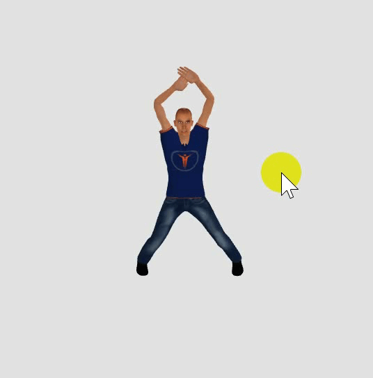
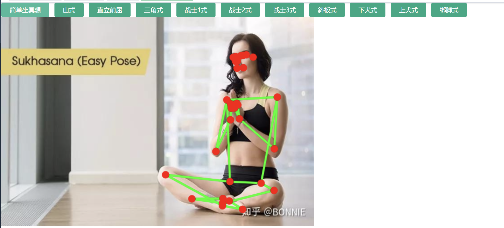
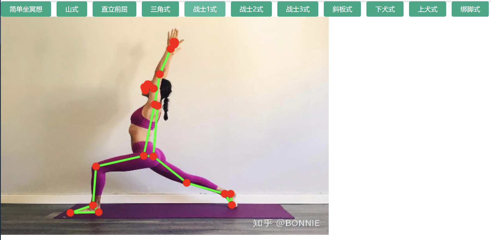

# 项目介绍

通过机器视觉模型库 mediapipe ,通过 vue.js 的方式识别人体动作并计数，
目前功能包括深蹲、仰卧起坐、俯卧撑、开合跳、引体向上的动作计数以及部分瑜伽动作的定义。

动作支持摄像头、视频和图片三种输入方式。

# 安装

```
## 克隆项目
git clone https://gitee.com/niufw/ai-health.git

## 进入项目目录
cd ai-health

# 安装依赖
npm install

# 建议不要直接使用 cnpm 安装依赖，会有各种诡异的 bug。可以通过如下操作解决 npm 下载速度慢的问题
npm install --registry=Https://registry.npmmirror.com

# 启动服务
npm run dev
```

浏览器访问 http://localhost:8080

# 发布

```
# 构建测试环境
npm run build:stage

# 构建生产环境
npm run build:prod
```

# 截图



![动作定义] 根据瑜伽的标准动作计算角度，然后可以进行动作对比或者计数


